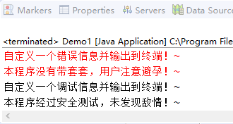
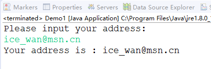
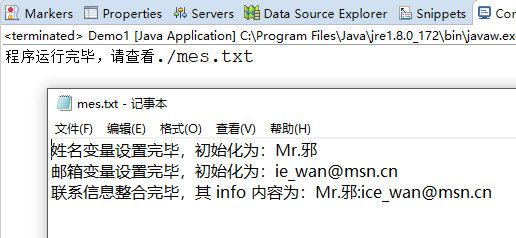
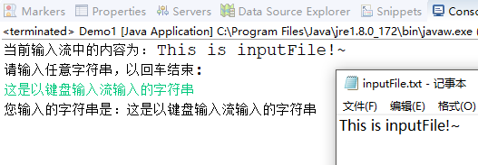

# 《老 "A" -- JAVA WEB 疯狂讲义》

# Java 基础 - 基本语法

## 一、基本语法

### 1. 输出错误信息以及调试信息

- #### 输出错误信息

    ```java
    System.err.println("错误信息内容");   //在双引号内可以自定义错误信息内容
    ```

- #### 输出调试信息

    ```java
    System.out.println("调试信息内容");   //在双引号内可以自定义调试信息内容
    ```

- #### 代码示例

    ```java
    public static void main(String[] args) {
        // TODO Auto-generated method stub
        //错误信息输出
        System.err.println("自定义一个错误信息并输出到终端！~");
        System.err.println("这把枪还没有上保险，注意别走火！~");    
        //调试信息输出
        System.out.println("自定义一个调试信息并输出到终端！~");
        System.out.println("这把枪里没有子弹，可以随便玩儿！~");
    }
    ```

    - ##### 运行结果，如下图所示

    


### 2. 从控制台输入字符

- ####  Scanner 扫描器类，用 Scanner 类的对象可以扫描 System 类中的 in 输入流

    ```java
    Scanner s = new Scanner(System.in);     
    //创建扫描器对象，针对 System.in 键盘输入流进行扫描
    ```

- #### 代码示例

    ```java
    import java.util.Scanner;   //引入 Scanner 所对应的包
    
    public class Demo{
    
    	public static void main(String[] args) {
    		// TODO Auto-generated method stub
    		//定义一个用于扫描的对象 并 命名为 s
    		Scanner s = new Scanner(System.in);
    		//在终端输出一个行用于提示用户输入的文字
    		System.out.println("Please input your address: ");
    		//声明一个字符串对象并存储用户在终端中输入的一行文字
    		String address = s.nextLine();
    		//输出刚刚输入的结果
    		System.out.println("Your address is : " + address);
    	}
    	
    }
    ```

    - ##### 运行结果，如下图所示

    

### 3. 重定向输出实现程序日志

- #### setOut()  方法用于重新分配 System 类的标准输出流

    ```java
    public static void setOut(PrintStream out);
    ```

- #### setErr()  方法用于重新分配 System 类的标准错误输出流

    ```java
    public static void setErr(PrintStream err);
    ```

- #### setIn()   方法用于重新设置 System 类的 in 成员变量， 即标准输入流

    ```java
    public static void setIn(InputStream in);
    ```

- #### 代码示例 1 --- setOut() / setErr()

    ```java
    import java.io.FileNotFoundException;
    import java.io.PrintStream;
    
    public class Demo {
    
        public static void main(String[] args) {
            // TODO Auto-generated method stub
            try {
                //定义 out 对象用于保留原有输出流
                PrintStream out = new PrintStream(System.out);
                //定义 ps 对象用于存储新的输出流，输出到当前目录下的 mes.txt 文件
                PrintStream ps = new PrintStream("./mes.txt");
                //重定向（更新）现在的输出流为 ps，即输出到 当前目录下的 mes.txt 文件
                System.setOut(ps);
                //定义变量
                String name = "Mr.邪";
                //输出描述内容，不会显示在屏幕上，此时已经输出（写入）到 mes.txt 文件中.
                System.out.println("姓名变量设置完毕，初始化为：Mr.邪");
                String email = "ice_wan@msn.cn";
                System.out.println("邮箱变量设置完毕，初始化为：ie_wan@msn.cn");
                String info = name + ":" + email;
                System.out.println("联系信息整合完毕，其 info 内容为：" + info);
                
                //恢复输出流，将输出流定向的终端
                System.setOut(out);
                //输出提示信息
                System.out.println("程序运行完毕，请查看./mes.txt");
            	
            }catch(FileNotFoundException e) {
                e.printStackTrace();
            }
        }
        
    }
    ```

    - ##### 运行结果，如下图所示

    ***注：程序运行结束后，会在工程在做目录下生成一个 ```mes.txt``` 的文本文件，打开该文本文件查看文件中内容。***

    

- #### 代码示例 2 --- setIn()

    ```java
    import java.io.FileInputStream;
    import java.io.InputStream;
    import java.util.Scanner;
    
    public class Demo1 {
    
    	public static void main(String[] args) throws Exception {
    		// TODO Auto-generated method stub
    		//保留当前系统输入流到 in 对象中(InputStream 不允许实例化，直接赋值)
    		InputStream in = System.in;
    		//将系统输入流重定向（更新）到当前工作目录下的 inputFile.txt 文件
    		System.setIn(new FileInputStream("./inputFile.txt"));
    		//定义扫描器，指向当前输入流，即 当前工作目录下的 inputFile.txt 文件
    		Scanner s = new Scanner(System.in);
    		//定义字符串存储当前输入流中的一行字符
    		String str = s.nextLine();
    		//输出这行字符
    		System.out.println("当前输入流中的内容为： " + str);
    		
    		//输入系统输入流（键盘输入流）
    		System.setIn(in);
    		//输出提示
    		System.out.println("请输入任意字符串，以回车结束: ");
    		//将扫描器指向当前的输入流（键盘输入流）
    		s = new Scanner(System.in);
    		//从当前输入流中得到一行字符（键盘输入流）
    		str = s.nextLine();
    		//输出信息
    		System.out.println("您输入的字符串是：" + str);
    	}
    
    }
    ```

    - ##### 运行结果，如下图所示

    